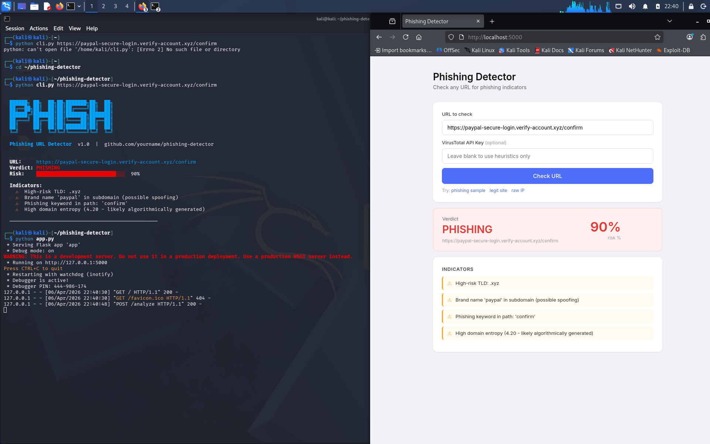

# Phishing Detector

A Python tool that analyzes URLs for phishing indicators using heuristic analysis and VirusTotal threat intelligence.

## Features
- 12 heuristic checks (suspicious TLDs, brand spoofing, domain entropy, raw IP detection, and more)
- VirusTotal API integration (70+ antivirus engines)
- CLI tool with colored output and batch scanning mode
- Web UI built with Flask
- Risk scoring from 0-100% with SAFE / SUSPICIOUS / PHISHING verdicts

## Installation
git clone https://github.com/milos-petrovic-cs/phishing-detector
cd phishing-detector
pip install -r requirements.txt

## Usage
**CLI:**
python cli.py https://suspicious-url.xyz/login
python cli.py --batch urls.txt

**Web UI:**
python app.py
Then open http://localhost:5000

## Built With
- Python
- Flask
- VirusTotal API
- Kali Linux

## Disclaimer
For educational and authorized security research purposes only.

## Screenshots

